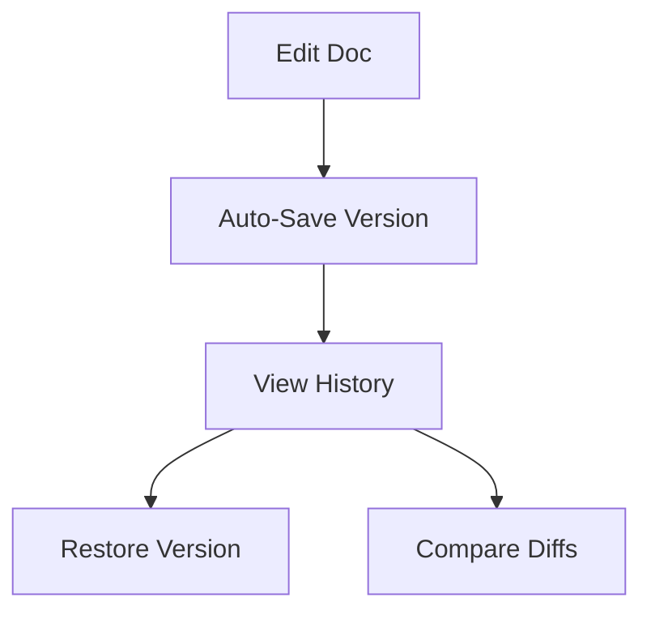

## Overview

ALGONETIC provides a comprehensive suite of tools for managing project documentation. You can organize content efficiently, collaborate with teams, track changes, search quickly, and customize your workspace to fit your needs. These features ensure your docs stay current and accessible.

<Columns cols={3}>
  <Card title="Document Organization" icon="folder" href="#document-organization">
    Categorize and structure your docs with folders and tags.
  </Card>
  <Card title="Collaboration" icon="users" href="#collaboration">
    Share and work together in real-time.
  </Card>
  <Card title="Version Control" icon="git-branch" href="#version-control">
    Track changes and revert when needed.
  </Card>
</Columns>

<Columns cols={2}>
  <Card title="Search Tools" icon="search" href="#search-tools">
    Find content instantly with advanced filtering.
  </Card>
  <Card title="Customization" icon="settings" href="#customization">
    Tailor your workspace to your workflow.
  </Card>
</Columns>

## Document Organization and Categorization

Organize your documentation using hierarchical folders and tags. Create nested structures for complex projects, such as `/api/reference` or `/guides/advanced`.

<Steps>
  <Step title="Create Folders" icon="folder-plus">
    Navigate to your workspace root and select "New Folder". Name it descriptively, like "User Guides".
  </Step>
  <Step title="Add Tags" icon="tag">
    Open a document and assign tags such as `api`, `tutorial`, or `internal`.
  </Step>
  <Step title="Categorize Content" icon="layers">
    Drag and drop files into folders. Use the sidebar to view your structure.
  </Step>
</Steps>

<Callout kind="tip">
  Use consistent naming conventions like "v1.0-api" for tags to improve discoverability.
</Callout>

## Collaboration and Sharing Options

Invite team members and share docs securely. Options include public links, role-based access, and real-time editing.

<Tabs>
  <Tab title="Team Invite" icon="user-plus">
    Go to Workspace Settings > Members. Enter emails and assign roles: Admin, Editor, Viewer.
  </Tab>
  <Tab title="Public Sharing" icon="share-2">
    Select a doc, click Share > Generate Link. Set expiration or password protection.
  </Tab>
  <Tab title="Embed" icon="code">
    Use the embed code for external sites:

````html
<iframe src="https://docs.example.com/embed/doc-id" width="100%" height="600"></iframe>
````

  </Tab>
</Tabs>

## Version Control for Docs

Maintain history with automatic versioning. View diffs, restore previous versions, and branch for experiments.



<Expandable title="Advanced Versioning" default-open="false">
  Create branches for major updates:

  ```
  1. Select doc > Versions > New Branch
  2. Name it "feature-login-docs"
  3. Merge when ready
  ```

  This prevents breaking live docs during reviews.
</Expandable>

## Search and Filtering Tools

Search across all docs with full-text indexing. Filter by tags, folders, or date.

| Filter Type | Example Usage | Result |
|-------------|---------------|--------|
| Keyword    | `api endpoint` | Matches titles and content |
| Tag        | `@api @v2`    | Tagged docs only |
| Folder     | `in:guides`   | Specific folder scope |
| Date       | `after:2024-01` | Recent changes |

<Callout kind="info">
  Pro tip: Combine filters like `@internal in:api after:2024` for precise results.
</Callout>

## Customization of Workspaces

Personalize your interface with themes, layouts, and integrations.

<CodeGroup tabs="JSON,CLI">
```json
{
  "theme": "dark",
  "sidebar": { "collapsed": true },
  "integrations": ["github", "slack"]
}
```
```bash
algonetic config set theme=dark
algonetic config set sidebar.collapsed=true
```
</CodeGroup>

Save custom views for recurring tasks, like "API Review" layout showing only tagged docs.

<Callout kind="success">
  Explore these features to streamline your documentation workflow. Start with organization for immediate impact.
</Callout>